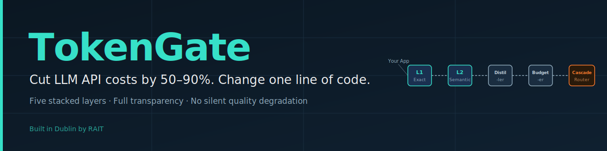
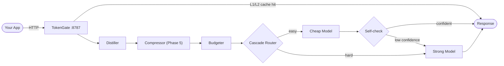

<p align="center">
  
</p>

<p align="center">
  
  
  
  
</p>

TokenGate is a drop-in local proxy that sits between your application and the LLM API (Anthropic / OpenAI-compatible). Five stacked optimisation layers fire on every request. Every decision is reported in `x-tokengate-*` response headers, a SQLite analytics database, and a live dashboard — no silent quality degradation, no hidden cost.

```python
# Before
client = Anthropic()

# After — that's the only change
client = Anthropic(base_url="http://localhost:8787")
```

Works identically with the OpenAI SDK: `OpenAI(base_url="http://localhost:8787/v1")`.

Built in Dublin by [RAIT](https://www.rait.ie).

---

## Why

LLM API bills grow quietly: repeated questions hit the API again and again, conversation histories balloon, simple requests go to expensive models, and verbose answers burn output tokens. Each problem has a known fix — but applying them means rewriting your app.

TokenGate applies all of them **outside your code**, transparently. Every optimisation decision is visible in response headers, logs, and a live dashboard.

---

## Five layers

| Layer | What it does | Typical savings |
|---|---|---|
| **L1 Exact cache** | Identical request → instant answer, zero API tokens | 100 % on repeats |
| **L2 Semantic cache** | Paraphrased question → finds the cached answer via local embeddings (no API cost) | 100 % on near-repeats |
| **Context distiller** | Long conversation history → rolling summary + the most relevant past turns. Pinned user facts are never dropped | 40–80 % of input tokens |
| **Cascade router** | Easy request → cheap model. Hard request → strong model. Auto-escalates if the cheap answer fails a self-check. Escalated requests cost *more* than going strong directly — the dashboard shows negative saved dollars honestly, not hidden | 60–90 % on easy traffic |
| **Output budgeter** | Per-request-type `max_tokens` caps + concision hints | 10–30 % of output tokens |

Safety rails: time-sensitive queries, personal data, and tool calls bypass caches. Lossy compression is opt-in (Phase 5). Every applied layer is recorded in `x-tokengate-*` headers.

---

## Quickstart

### Install

```bash
pip install rait-tokengate
```

### Set up

```bash
rait install           # interactive wizard: provider, API key, port
# or non-interactively:
rait install --provider anthropic --yes
```

Your API key is stored in `~/.rait/.env` with `0600` permissions and never appears in config or logs.

### Start

```bash
rait start             # foreground (Ctrl+C to stop)
rait start --detach    # background daemon
rait status            # health check
```

### Point your app at it

```python
from anthropic import Anthropic
client = Anthropic(base_url="http://localhost:8787")
# Every request now passes through the optimisation pipeline
```

### Watch the savings

```bash
rait stats             # terminal JSON summary
```

Or open **http://localhost:8787/dashboard** — savings by layer, cache hit rates, escalation rate, your most expensive routes.

---

## CLI reference

| Command | Description |
|---|---|
| `rait install` | Interactive setup wizard. Options: `--provider anthropic\|openai\|both`, `--port N`, `--yes` for non-interactive |
| `rait start` | Start the gateway. `--detach` / `-d` to run in background |
| `rait stop` | Stop the background daemon |
| `rait status` | Health: port, PID, upstream reachability |
| `rait stats` | Tokens and dollars saved, by layer (JSON) |
| `rait test` | Send a sample request and show which layers fired |
| `rait cache --clear` | Wipe all caches |

---

## Configuration

Everything lives in `~/.rait/tokengate.yaml`. Defaults are sane — you only need this file to override them.

```yaml
# ~/.rait/tokengate.yaml

bind: 127.0.0.1   # never expose on 0.0.0.0 without also setting tokengate_key
port: 8787
log_level: info   # debug | info | warning

cache:
  exact_ttl_seconds: 86400      # 24 h
  semantic_threshold: 0.93      # cosine similarity floor for a cache hit
  max_entries: 50000
  serve_unverified: false       # serve semantic hits without re-embedding verify
  blocklist_patterns:           # regex — matching prompts skip the cache
    - '\btoday\b'
    - '\bnow\b'
    - '\bprice\b'

distill:
  threshold_tokens: 6000        # compress history above this many input tokens
  keep_recent_turns: 4          # always keep the N most recent turns verbatim
  top_k: 3                      # retrieve top-K relevant past turns by embedding

budget:
  chat: 1024
  code: 2048
  long_form: 4096
  extraction: 512

router:
  difficulty_threshold: 0.4     # 0–1; below → cheap model, above → strong
  escalation_enabled: true
  escalation_threshold: 3       # self-check confidence ≤ N/5 triggers escalation
  tools_tier: strong            # requests with tool calls always go to strong
  cheap_model:
    anthropic: claude-haiku-4-5
    openai: gpt-4o-mini
  strong_model:
    anthropic: claude-sonnet-4-6
    openai: gpt-4o
```

---

## How it works

### Pipeline



### Request lifecycle

1. **Normalise** — OpenAI and Anthropic request formats are normalised to a common `GatewayRequest`.
2. **L1 exact cache** — SHA-256 key over model + messages + parameters. Hits skip everything below.
3. **L2 semantic cache** — local sentence-transformer embedding, cosine similarity ≥ threshold. Hits skip everything below.
4. **Distiller** — if input tokens exceed `threshold_tokens`, replace old turns with a rolling summary generated by a cheap model, keeping pinned user facts and the N most recent turns.
5. **Compressor** *(Phase 5 — coming)* — optional lossy prompt compression via LLMLingua-style pruning.
6. **Budgeter** — injects a `max_tokens` cap appropriate to the detected request type (chat / code / extraction / long-form) and, for extraction requests, a concision hint.
7. **Cascade router** — scores difficulty (0–1) from six features: prompt length, tool presence, code markers, maths markers, multi-step language, and conversation depth. Easy requests go to the cheap model. The cheap response is then self-checked (one-digit confidence rating). If confidence ≤ threshold, the request escalates to the strong model. Cost accounting is exact: `est_saved = baseline_cost − (cheap + check + strong)`. Negative values (escalation overhead) are shown honestly.
8. **Analytics** — every request is written to SQLite: tokens, model, layers applied, cost, saved, escalation flag, latency.

---

## Honest numbers

Semantic caching, model cascading, and prompt compression each exist as separate research and products. TokenGate's contribution is the **transparent, self-measuring combination**: one proxy, five layers, per-request decisions, and an escalation log that improves routing over time.

Your actual savings depend entirely on your traffic:

- A FAQ chatbot with repetitive questions: the caches dominate — savings can exceed 90 %.
- A stream of unique, hard, long-form creative tasks: mostly distillation and budgeting — expect 15–30 %.
- A mixed workload with many easy questions: cascade routing adds another 30–60 % on top.

Run in passthrough mode first — Phase 1 gives full spend visibility with zero optimisation — then enable layers and compare. The dashboard never shows estimated marketing numbers, only measured ones from your actual traffic.

---

## Security

- Binds to **localhost only** by default. Exposing externally requires setting `TOKENGATE_KEY` (checked as `x-tokengate-key` header on every request). Never run on `0.0.0.0` without it — the server refuses to start.
- Cached responses may contain user data. Enable at-rest encryption with `TOKENGATE_ENCRYPT_KEY`. Use `rait cache --clear` or `DELETE /cache` for data removal (GDPR).
- No external network calls except your configured upstream providers.
- All requests go through the official provider APIs with your key — TokenGate does not bypass any provider policies or moderation.
- SQL queries use parameterised statements throughout; API keys are never logged.

---

## Status

| Phase | What | State |
|---|---|---|
| 1 — Foundation | Proxy, analytics, exact cache, streaming passthrough | ✅ Complete |
| 2 — Semantic cache | Embedding-based cache with similarity threshold and LRU index | ✅ Complete |
| 3 — Distiller + Budgeter | Rolling summarisation, pinned facts, per-type output caps | ✅ Complete |
| 4 — Cascade router | Difficulty scoring, cheap → self-check → escalation, cost accounting | ✅ Complete |
| 5 — Compressor + ops | Prompt compression, rate limiting, Docker, per-route policies | 🔧 In progress |

196 tests, all passing. Phases 1–4 are the live feature set.

---

## Development

```bash
git clone https://github.com/YOUR_ORG/tokengate
cd tokengate
pip install -e ".[dev]"
pytest                  # full suite runs offline (mock provider)
```

The test suite uses a bundled mock transport — no real API calls, no API key required. Semantic cache tests require `pip install -e ".[semantic]"` for `sentence-transformers`.

See `TOKENGATE.md` for the complete build specification and acceptance criteria.

---

## License

MIT — see [LICENSE](LICENSE).

---

*Questions, audits, or managed setup for your business: [rait.ie](https://www.rait.ie) · misha@rait.ie*
